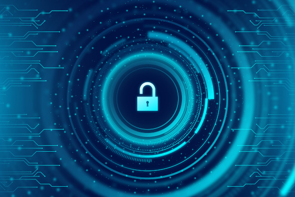

# iOS Security
A collaborative list of learning materials about a security in the iOS apps

## Welcome to iOS Security repository 👋

The main goal of this repo is to help people learn how to make their iOS apps more secure. Security is not a topic that all iOS developers touch on a daily basis. To some of us it seems quite hard to start learning about it so I thought it would be great to create a collaborative space with all the useful links to the articles, videos, podcasts, books and other useful resources 🙃

Please feel free to submit your Pull Requests, suggest new links that you find useful and helpful.

## 📝 Articles

## 📹 Videos

### WWDC videos

#### WWDC 2020

- Secure your app: threat modeling and anti-patterns - https://developer.apple.com/videos/play/wwdc2020/10189/
- One-tap account security upgrades - https://developer.apple.com/videos/play/wwdc2020/10666/

#### WWDC 2019

- Cryptography and Your Apps - https://developer.apple.com/videos/play/wwdc2019/709/

#### WWDC 2018

- Data You Can Trust - https://developer.apple.com/videos/play/wwdc2018/222/
- AVContentKeySession Best Practices - https://developer.apple.com/videos/play/wwdc2018/507/
- Automatic Strong Passwords and Security Code AutoFill - https://developer.apple.com/videos/play/wwdc2018/204/
- Strategies for Securing Web Content - https://developer.apple.com/videos/play/wwdc2018/207/

#### WWDC 2017

- Your Apps and Evolving Network Security Standards - https://developer.apple.com/videos/play/wwdc2017/701/

#### WWDC 2016

- What's New in Security - https://developer.apple.com/videos/play/wwdc2016/706/
- How iOS Security Really Works - https://developer.apple.com/videos/play/wwdc2016/705/

#### WWDC 2015

- Security and Your Apps - https://developer.apple.com/videos/play/wwdc2015/706/

## 🎧 Podcasts

## 📚 Books

